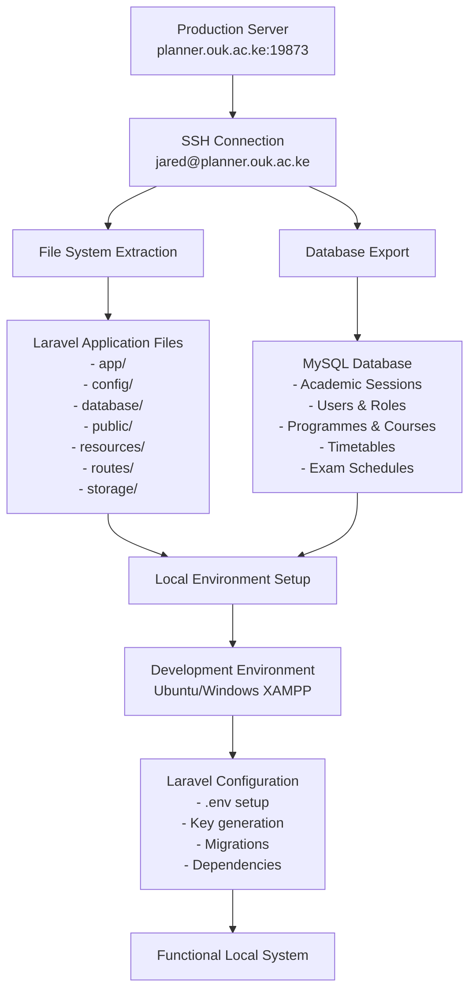
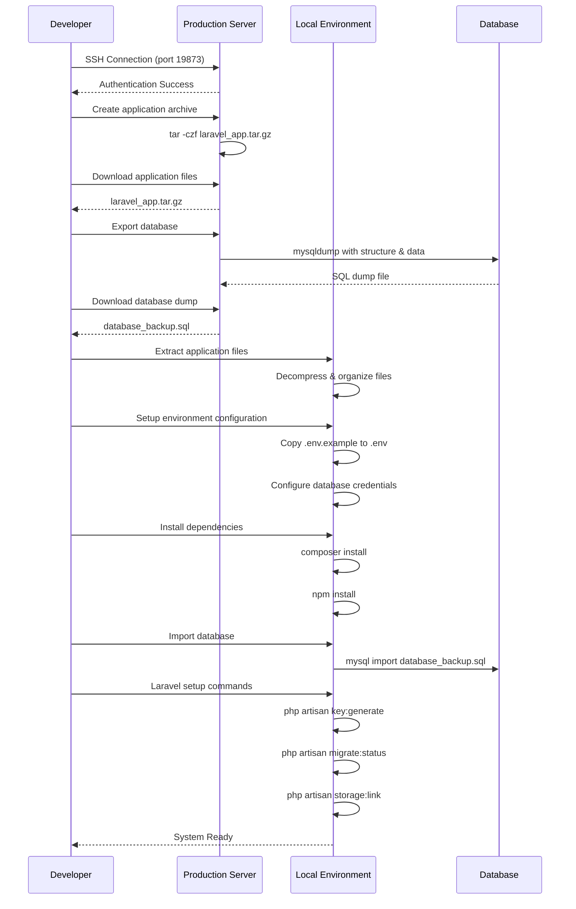

# Design Document: Laravel System Cloning Guide

## Overview

This design document formalizes the technical approach for cloning the OUK Timetabling Laravel system from production server to local development environment. The system is a comprehensive web-based timetabling application built with Laravel 11, featuring role-based access control, academic session management, and complex scheduling functionality. The cloning process ensures complete data integrity while maintaining security best practices for transferring production data to development environments.

## Architecture



## Sequence Diagrams

### Main Cloning Workflow



## Components and Interfaces

### Component 1: SSH Connection Manager

**Purpose**: Manages secure connection to production server for file and database operations

**Interface**:
```pascal
STRUCTURE SSHConnection
  host: String = "planner.ouk.ac.ke"
  port: Integer = 19873
  username: String = "jared"
  authentication_method: String = "key_based"
END STRUCTURE

PROCEDURE establishConnection(connection_params)
  INPUT: connection_params of type SSHConnection
  OUTPUT: connection_status of type Boolean
  
  SEQUENCE
    VALIDATE connection_params
    ATTEMPT ssh_connect(connection_params.host, connection_params.port)
    AUTHENTICATE using connection_params.username
    RETURN connection_status
  END SEQUENCE
END PROCEDURE
```

**Responsibilities**:
- Establish secure SSH connection to production server
- Maintain connection stability during file transfers
- Handle authentication and connection errors
- Provide secure channel for command execution

### Component 2: File System Extractor

**Purpose**: Extracts Laravel application files from production server while preserving structure and permissions

**Interface**:
```pascal
STRUCTURE FileExtractionConfig
  source_path: String = "/var/www/html/timetabling"
  exclude_patterns: Array = [".git", "node_modules", "vendor", "storage/logs"]
  compression_format: String = "tar.gz"
END STRUCTURE

PROCEDURE extractApplicationFiles(config)
  INPUT: config of type FileExtractionConfig
  OUTPUT: archive_path of type String
  
  SEQUENCE
    CREATE exclusion_list FROM config.exclude_patterns
    EXECUTE tar_command WITH exclusion_list
    COMPRESS files TO config.compression_format
    RETURN archive_path
  END SEQUENCE
END PROCEDURE
```

**Responsibilities**:
- Create compressed archive of Laravel application
- Exclude unnecessary files (logs, cache, dependencies)
- Preserve file permissions and directory structure
- Generate transfer-optimized archive format

### Component 3: Database Export Manager

**Purpose**: Exports production database with complete schema and data while ensuring data integrity

**Interface**:
```pascal
STRUCTURE DatabaseExportConfig
  database_name: String
  export_structure: Boolean = true
  export_data: Boolean = true
  compression: Boolean = true
  exclude_tables: Array = ["sessions", "password_resets", "personal_access_tokens"]
END STRUCTURE

PROCEDURE exportDatabase(config)
  INPUT: config of type DatabaseExportConfig
  OUTPUT: export_file_path of type String
  
  SEQUENCE
    VALIDATE database_connection
    BUILD mysqldump_command WITH config.parameters
    EXECUTE export_command
    IF config.compression THEN
      COMPRESS export_file
    END IF
    RETURN export_file_path
  END SEQUENCE
END PROCEDURE
```

**Responsibilities**:
- Generate complete database dump with structure and data
- Handle large database exports efficiently
- Exclude sensitive or temporary data tables
- Provide compressed export for faster transfer

### Component 4: Local Environment Configurator

**Purpose**: Sets up and configures the local development environment for the cloned Laravel application

**Interface**:
```pascal
STRUCTURE LocalEnvironmentConfig
  web_server: String = "apache" OR "nginx"
  php_version: String = "8.2+"
  database_system: String = "mysql"
  local_domain: String = "timetabling.local"
END STRUCTURE

PROCEDURE setupLocalEnvironment(config, app_files, database_dump)
  INPUT: config of type LocalEnvironmentConfig
       app_files of type String (path)
       database_dump of type String (path)
  OUTPUT: setup_status of type Boolean
  
  SEQUENCE
    EXTRACT app_files TO web_directory
    CONFIGURE virtual_host FOR config.local_domain
    SETUP database_connection
    IMPORT database_dump
    CONFIGURE laravel_environment
    RETURN setup_status
  END SEQUENCE
END PROCEDURE
```

**Responsibilities**:
- Extract and organize application files in local web directory
- Configure web server virtual host
- Set up local database and import production data
- Configure Laravel environment variables for local development

## Data Models

### Model 1: CloneOperation

```pascal
STRUCTURE CloneOperation
  id: UUID
  source_server: String
  target_environment: String
  operation_type: String = "full_clone" OR "files_only" OR "database_only"
  status: String = "pending" OR "in_progress" OR "completed" OR "failed"
  started_at: DateTime
  completed_at: DateTime
  file_size: Integer
  database_size: Integer
  error_log: Text
END STRUCTURE
```

**Validation Rules**:
- source_server must be valid hostname or IP
- target_environment must be "development" or "staging"
- operation_type must be one of allowed values
- file_size and database_size must be positive integers

### Model 2: SystemConfiguration

```pascal
STRUCTURE SystemConfiguration
  environment: String = "production" OR "development" OR "staging"
  database_config: DatabaseConfig
  server_config: ServerConfig
  laravel_config: LaravelConfig
  security_config: SecurityConfig
END STRUCTURE

STRUCTURE DatabaseConfig
  host: String
  port: Integer
  database_name: String
  username: String
  password: String (encrypted)
  charset: String = "utf8mb4"
  collation: String = "utf8mb4_unicode_ci"
END STRUCTURE

STRUCTURE LaravelConfig
  app_name: String
  app_env: String
  app_debug: Boolean
  app_url: String
  app_key: String (encrypted)
END STRUCTURE
```

**Validation Rules**:
- Database port must be between 1024-65535
- App environment must match allowed values
- App key must be base64 encoded Laravel key format
- All passwords must be encrypted at rest

## Algorithmic Pseudocode

### Main Cloning Algorithm

```pascal
ALGORITHM performSystemClone(source_config, target_config)
INPUT: source_config of type SystemConfiguration
       target_config of type SystemConfiguration
OUTPUT: clone_result of type CloneOperation

BEGIN
  ASSERT source_config.environment = "production"
  ASSERT target_config.environment IN ["development", "staging"]
  
  // Step 1: Initialize cloning operation
  operation ← createCloneOperation(source_config, target_config)
  operation.status ← "in_progress"
  
  // Step 2: Establish secure connection
  connection ← establishSSHConnection(source_config.server_config)
  ASSERT connection.is_authenticated = true
  
  // Step 3: Extract application files with loop invariant
  file_extraction_result ← extractApplicationFiles(connection)
  ASSERT file_extraction_result.success = true
  
  // Step 4: Export database with integrity checks
  database_export_result ← exportDatabase(connection, source_config.database_config)
  ASSERT database_export_result.integrity_check = true
  
  // Step 5: Transfer files to local environment
  transfer_result ← transferFiles(file_extraction_result.archive_path, 
                                 database_export_result.dump_path,
                                 target_config.server_config.local_path)
  ASSERT transfer_result.checksum_verified = true
  
  // Step 6: Setup local environment
  setup_result ← setupLocalEnvironment(target_config, 
                                      transfer_result.app_files_path,
                                      transfer_result.database_dump_path)
  ASSERT setup_result.laravel_configured = true
  
  // Step 7: Finalize operation
  operation.status ← "completed"
  operation.completed_at ← getCurrentDateTime()
  
  ASSERT operation.status = "completed" AND setup_result.system_functional = true
  
  RETURN operation
END
```

**Preconditions**:
- Source system is accessible via SSH
- Target environment has required dependencies installed
- Sufficient disk space available for files and database
- Network connectivity between source and target systems

**Postconditions**:
- Complete functional Laravel application in target environment
- All production data successfully migrated
- Local environment properly configured
- System passes basic functionality tests

**Loop Invariants**:
- File integrity maintained throughout transfer process
- Database consistency preserved during export/import
- Configuration security maintained across environments

### File Transfer Algorithm

```pascal
ALGORITHM transferFiles(source_archive, database_dump, target_path)
INPUT: source_archive of type String (file path)
       database_dump of type String (file path)
       target_path of type String (directory path)
OUTPUT: transfer_result of type TransferResult

BEGIN
  // Validate input files exist and are readable
  ASSERT fileExists(source_archive) AND isReadable(source_archive)
  ASSERT fileExists(database_dump) AND isReadable(database_dump)
  
  // Calculate checksums for integrity verification
  source_checksum ← calculateChecksum(source_archive)
  database_checksum ← calculateChecksum(database_dump)
  
  // Transfer files with progress tracking
  app_files_path ← copyFile(source_archive, target_path + "/app_backup.tar.gz")
  database_path ← copyFile(database_dump, target_path + "/database_backup.sql")
  
  // Verify transfer integrity
  transferred_app_checksum ← calculateChecksum(app_files_path)
  transferred_db_checksum ← calculateChecksum(database_path)
  
  ASSERT source_checksum = transferred_app_checksum
  ASSERT database_checksum = transferred_db_checksum
  
  // Extract application files
  extraction_path ← extractArchive(app_files_path, target_path + "/application")
  
  RETURN TransferResult{
    success: true,
    app_files_path: extraction_path,
    database_dump_path: database_path,
    checksum_verified: true
  }
END
```

**Preconditions**:
- Source files exist and are accessible
- Target directory has write permissions
- Sufficient disk space for extraction

**Postconditions**:
- Files successfully transferred with verified integrity
- Application files extracted to target directory
- Database dump ready for import

**Loop Invariants**:
- Checksum verification passes for all transferred files
- File permissions preserved during transfer

## Key Functions with Formal Specifications

### Function 1: configureLocalEnvironment()

```pascal
FUNCTION configureLocalEnvironment(app_path, database_config)
INPUT: app_path of type String
       database_config of type DatabaseConfig
OUTPUT: configuration_result of type Boolean
```

**Preconditions:**
- `app_path` points to valid Laravel application directory
- `database_config` contains valid database connection parameters
- Local web server is installed and running
- PHP 8.2+ is installed with required extensions

**Postconditions:**
- Laravel .env file configured with local database settings
- Application key generated and set
- Database connection established and tested
- Storage directories have proper permissions
- Web server virtual host configured

**Loop Invariants:** N/A (no loops in this function)

### Function 2: validateSystemRequirements()

```pascal
FUNCTION validateSystemRequirements(target_environment)
INPUT: target_environment of type SystemConfiguration
OUTPUT: validation_result of type ValidationResult
```

**Preconditions:**
- `target_environment` is properly initialized
- System has access to check installed software versions

**Postconditions:**
- Returns validation result with detailed requirement checks
- All Laravel system requirements verified
- Database system compatibility confirmed
- Web server configuration validated

**Loop Invariants:**
- For requirement checking loops: All previously checked requirements remain valid

## Example Usage

```pascal
// Example 1: Complete system clone
source_config ← SystemConfiguration{
  environment: "production",
  server_config: ServerConfig{
    host: "planner.ouk.ac.ke",
    port: 19873,
    username: "jared"
  },
  database_config: DatabaseConfig{
    host: "localhost",
    database_name: "timetabling_prod",
    username: "root"
  }
}

target_config ← SystemConfiguration{
  environment: "development",
  server_config: ServerConfig{
    local_path: "/var/www/html/timetabling-dev"
  },
  database_config: DatabaseConfig{
    host: "localhost",
    database_name: "timetabling_dev",
    username: "root"
  }
}

clone_result ← performSystemClone(source_config, target_config)

IF clone_result.status = "completed" THEN
  DISPLAY "System successfully cloned to development environment"
  runPostCloneTests(target_config)
ELSE
  DISPLAY "Clone operation failed: " + clone_result.error_log
END IF

// Example 2: Database-only clone
database_only_config ← CloneOperation{
  operation_type: "database_only",
  source_server: "planner.ouk.ac.ke",
  target_environment: "development"
}

database_result ← cloneDatabase(database_only_config)

// Example 3: Files-only clone (for code updates)
files_only_config ← CloneOperation{
  operation_type: "files_only",
  source_server: "planner.ouk.ac.ke",
  target_environment: "development"
}

files_result ← cloneApplicationFiles(files_only_config)
```

## Correctness Properties

*A property is a characteristic or behavior that should hold true across all valid executions of a system-essentially, a formal statement about what the system should do. Properties serve as the bridge between human-readable specifications and machine-verifiable correctness guarantees.*

### Property 1: Connection Retry Behavior

*For any* connection failure scenario, the SSH_Manager should implement exponential backoff retry logic with exactly 3 attempts before giving up.

**Validates: Requirement 1.3**

### Property 2: Comprehensive Event Logging

*For any* connection attempt or status change, the SSH_Manager should log the event with proper timestamp and details for audit purposes.

**Validates: Requirement 1.5**

### Property 3: File Exclusion Consistency

*For any* directory structure containing excluded patterns (.git, node_modules, vendor, storage/logs), the File_Extractor should always filter out these directories from the archive.

**Validates: Requirement 2.2**

### Property 4: Archive Format Standardization

*For any* file extraction operation, the File_Extractor should always produce archives in tar.gz format regardless of input content or size.

**Validates: Requirement 2.4**

### Property 5: Integrity Verification Requirement

*For any* completed extraction operation, the File_Extractor should always perform integrity verification before marking the archive ready for transfer.

**Validates: Requirement 2.5**

### Property 6: Complete Database Export

*For any* database export operation, the Database_Exporter should always include both schema structure and data in the mysqldump output.

**Validates: Requirement 3.1**

### Property 7: Temporary Table Exclusion

*For any* database containing temporary tables (sessions, password_resets, personal_access_tokens), the Database_Exporter should always exclude these tables from the export.

**Validates: Requirement 3.2**

### Property 8: Pre-Export Validation

*For any* database export operation, the Database_Exporter should always verify connectivity and permissions before starting the export process.

**Validates: Requirement 3.4**

### Property 9: Export Error Reporting

*For any* failed database export operation, the Database_Exporter should always provide detailed error information and recovery options.

**Validates: Requirement 3.5**

### Property 10: Universal Checksum Calculation

*For any* file transfer operation, the Clone_System should always calculate checksums for all source files before transfer begins.

**Validates: Requirement 4.1**

### Property 11: Checksum Verification Consistency

*For any* completed file transfer, the Clone_System should always verify that checksums match between source and target files.

**Validates: Requirement 4.2**

### Property 12: Automatic Corruption Recovery

*For any* checksum verification failure, the Clone_System should automatically re-download the corrupted files without manual intervention.

**Validates: Requirement 4.3**

### Property 13: Progress Indication for Large Transfers

*For any* file transfer larger than 100MB, the Clone_System should provide progress indicators to show transfer status.

**Validates: Requirement 4.4**

### Property 14: Resume Capability for Interrupted Transfers

*For any* interrupted transfer of large files, the Clone_System should support resume capability to continue from the interruption point.

**Validates: Requirement 4.5**

### Property 15: Designated Directory Extraction

*For any* local environment setup, the Environment_Configurator should always extract application files to the designated web directory.

**Validates: Requirement 5.1**

### Property 16: Environment File Generation

*For any* Laravel application setup, the Environment_Configurator should always create a .env file from .env.example with local development settings.

**Validates: Requirement 5.2**

### Property 17: Security Key Generation

*For any* Laravel configuration operation, the Environment_Configurator should always generate a new application key for security purposes.

**Validates: Requirement 5.3**

### Property 18: Database Configuration Setup

*For any* local environment configuration, the Environment_Configurator should properly configure database connection parameters for the local MySQL instance.

**Validates: Requirement 5.4**

### Property 19: Permission Setting Consistency

*For any* Laravel application setup, the Environment_Configurator should always set proper file permissions for storage and bootstrap/cache directories.

**Validates: Requirement 5.5**

### Property 20: Database Creation Logic

*For any* database import operation where the target database doesn't exist, the Clone_System should create the local database before importing.

**Validates: Requirement 6.1**

### Property 21: Relationship Preservation

*For any* database import operation, the Clone_System should maintain all relationships and constraints from the production database.

**Validates: Requirement 6.2**

### Property 22: Post-Import Verification

*For any* completed database import, the Clone_System should always verify database integrity and accessibility.

**Validates: Requirement 6.3**

### Property 23: Migration Status Verification

*For any* database setup completion, the Clone_System should always run Laravel migration status check to ensure schema consistency.

**Validates: Requirement 6.4**

### Property 24: Import Error Handling

*For any* failed database import operation, the Clone_System should provide detailed error information and rollback options.

**Validates: Requirement 6.5**

### Property 25: PHP Version Validation

*For any* clone operation startup, the Clone_System should validate that PHP version is 8.2 or higher before proceeding.

**Validates: Requirement 7.1**

### Property 26: Extension Validation

*For any* system requirements check, the Clone_System should verify all required PHP extensions are installed.

**Validates: Requirement 7.2**

### Property 27: Database Version Compatibility

*For any* system validation, the Clone_System should check MySQL/MariaDB version compatibility before starting operations.

**Validates: Requirement 7.3**

### Property 28: Disk Space Validation

*For any* clone operation, the Clone_System should verify sufficient disk space is available for application files and database.

**Validates: Requirement 7.4**

### Property 29: Requirement Failure Instructions

*For any* unmet system requirement, the Clone_System should provide specific installation instructions to resolve the issue.

**Validates: Requirement 7.5**

### Property 30: Platform-Specific Path Adaptation

*For any* platform detection, the Clone_System should automatically adjust file paths and permissions based on the detected platform.

**Validates: Requirement 8.3**

### Property 31: Platform-Specific Instructions

*For any* supported platform, the Clone_System should provide platform-specific configuration instructions.

**Validates: Requirement 8.4**

### Property 32: Web Server Configuration Handling

*For any* platform setup, the Clone_System should handle platform differences in web server configuration appropriately.

**Validates: Requirement 8.5**

### Property 33: Encrypted Communication Requirement

*For any* data transfer operation, the Clone_System should use encrypted SSH tunnels for all communications.

**Validates: Requirement 9.1**

### Property 34: Configuration Data Sanitization

*For any* sensitive configuration data, the Clone_System should sanitize it before local import to protect production secrets.

**Validates: Requirement 9.2**

### Property 35: Development Key Generation

*For any* development environment setup, the Clone_System should generate new application keys instead of using production keys.

**Validates: Requirement 9.3**

### Property 36: Production Credential Exclusion

*For any* local configuration setup, the Clone_System should exclude production API keys and credentials from the local environment.

**Validates: Requirement 9.4**

### Property 37: User Data Anonymization Options

*For any* sensitive user data transfer, the Clone_System should provide options to anonymize or exclude the data.

**Validates: Requirement 9.5**

### Property 38: Detailed Error Messaging

*For any* operation failure, the Clone_System should provide detailed error messages with specific failure reasons.

**Validates: Requirement 10.1**

### Property 39: Comprehensive Operation Logging

*For any* operation or error, the Clone_System should log it for troubleshooting purposes.

**Validates: Requirement 10.2**

### Property 40: Network Retry Mechanisms

*For any* network issue occurrence, the Clone_System should implement retry mechanisms with exponential backoff.

**Validates: Requirement 10.3**

### Property 41: Partial Failure Recovery Options

*For any* partial failure scenario, the Clone_System should provide recovery options (resume, retry, skip).

**Validates: Requirement 10.4**

### Property 42: Temporary File Cleanup

*For any* operation completion (successful or failed), the Clone_System should clean up temporary files.

**Validates: Requirement 10.5**

### Property 43: Parallel Operation Utilization

*For any* multiple file transfer scenario, the Clone_System should use parallel operations where possible to improve efficiency.

**Validates: Requirement 11.3**

### Property 44: Completion Time Estimation

*For any* long-running operation, the Clone_System should provide estimated completion times.

**Validates: Requirement 11.4**

### Property 45: Large Dataset Optimization

*For any* database larger than 500MB, the Clone_System should apply optimization techniques for better performance.

**Validates: Requirement 11.5**

### Property 46: Operation Audit Logging

*For any* clone operation, the Clone_System should log it with timestamps and user attribution for audit purposes.

**Validates: Requirement 12.1**

### Property 47: Progress Tracking

*For any* operation in progress, the Clone_System should track and provide detailed status updates.

**Validates: Requirement 12.2**

### Property 48: Summary Report Generation

*For any* completed operation, the Clone_System should generate summary reports with file sizes and timing information.

**Validates: Requirement 12.3**

### Property 49: Production Access Audit Trails

*For any* production server access, the Clone_System should maintain audit trails for security and compliance.

**Validates: Requirement 12.4**

### Property 50: Real-Time Progress Indicators

*For any* major operation, the Clone_System should provide real-time progress indicators to keep users informed.

**Validates: Requirement 12.5**

## Error Handling

### Error Scenario 1: SSH Connection Failure

**Condition**: Unable to establish SSH connection to production server
**Response**: 
- Retry connection with exponential backoff (3 attempts)
- Verify network connectivity and server availability
- Check SSH key authentication and permissions
- Log detailed connection error for troubleshooting

**Recovery**: 
- Provide alternative connection methods (password authentication)
- Suggest network configuration checks
- Offer manual file transfer instructions as fallback

### Error Scenario 2: Database Export Failure

**Condition**: mysqldump command fails or produces corrupted export
**Response**:
- Verify database connectivity and permissions
- Check available disk space for export file
- Validate database integrity before export
- Use alternative export methods (phpMyAdmin, custom scripts)

**Recovery**:
- Attempt export with different parameters (smaller chunks)
- Provide table-by-table export option
- Offer database repair procedures if corruption detected

### Error Scenario 3: Local Environment Setup Failure

**Condition**: Laravel application fails to configure properly in local environment
**Response**:
- Validate system requirements (PHP version, extensions)
- Check file permissions and ownership
- Verify database connection parameters
- Test web server configuration

**Recovery**:
- Provide step-by-step manual configuration guide
- Offer Docker-based alternative setup
- Generate diagnostic report for troubleshooting

### Error Scenario 4: File Transfer Integrity Failure

**Condition**: Checksum verification fails for transferred files
**Response**:
- Re-download corrupted files
- Verify network stability during transfer
- Check source file integrity
- Use alternative transfer methods (rsync, scp)

**Recovery**:
- Implement resume capability for large file transfers
- Provide file-by-file transfer option
- Offer compression alternatives for better transfer reliability

## Testing Strategy

### Unit Testing Approach

**Core Components Testing**:
- SSH connection establishment and authentication
- File extraction and compression algorithms
- Database export and import procedures
- Environment configuration functions
- Checksum calculation and verification

**Test Coverage Goals**: 90% code coverage for all cloning components

**Key Test Cases**:
- Valid and invalid SSH credentials
- Large file handling and memory management
- Database export with various data types and sizes
- Environment configuration with different server setups
- Error handling and recovery procedures

### Property-Based Testing Approach

**Property Test Library**: PHPUnit with custom property generators

**Properties to Test**:
1. **Idempotency**: Running clone operation multiple times produces same result
2. **Data Preservation**: All source data appears correctly in target system
3. **Configuration Isolation**: Development environment never contains production secrets
4. **File Integrity**: All transferred files maintain exact binary equivalence
5. **System Functionality**: Cloned system provides same functionality as source

**Test Data Generation**:
- Generate various database schemas and data volumes
- Create different Laravel application configurations
- Simulate network conditions and server environments
- Test with different user permissions and access levels

### Integration Testing Approach

**End-to-End Scenarios**:
- Complete production-to-development clone
- Partial clones (files-only, database-only)
- Multi-environment cloning (staging, testing)
- Recovery from various failure points

**Environment Testing**:
- Ubuntu development environments
- Windows XAMPP setups
- Docker containerized environments
- Cloud-based development platforms

**Performance Testing**:
- Large database cloning (>1GB)
- High file count applications (>10,000 files)
- Network bandwidth limitations
- Concurrent clone operations

## Performance Considerations

**Database Export Optimization**:
- Use mysqldump with optimized parameters for large datasets
- Implement chunked export for databases >500MB
- Compress exports to reduce transfer time by 60-80%
- Parallel table export for multi-table databases

**File Transfer Optimization**:
- Exclude unnecessary files (logs, cache, node_modules) to reduce size by 70%
- Use tar with gzip compression for optimal size/speed ratio
- Implement resume capability for interrupted transfers
- Batch small files to reduce transfer overhead

**Local Setup Optimization**:
- Pre-validate system requirements before starting clone
- Use Laravel's built-in optimization commands (config:cache, route:cache)
- Configure local database with appropriate memory settings
- Set up proper file permissions during extraction

**Network Optimization**:
- Use compression for all data transfers
- Implement connection pooling for multiple operations
- Monitor bandwidth usage and adjust transfer methods
- Provide progress indicators for long-running operations

## Security Considerations

**Production Data Protection**:
- Sanitize sensitive data before local import (user passwords, API keys)
- Exclude production-specific configuration files
- Remove or anonymize personal identifiable information (PII)
- Implement data retention policies for development environments

**Access Control**:
- Require SSH key-based authentication for production access
- Limit clone operations to authorized personnel only
- Log all clone operations with user attribution
- Implement role-based access for different clone types

**Environment Isolation**:
- Generate new application keys for development environments
- Use separate database credentials for local development
- Disable production integrations (email, payment gateways)
- Configure development-specific service endpoints

**Data Transmission Security**:
- Use encrypted SSH tunnels for all data transfers
- Verify file integrity using cryptographic checksums
- Implement secure temporary file handling
- Clean up temporary files after successful transfer

**Compliance Considerations**:
- Ensure GDPR compliance for EU user data
- Implement data anonymization for sensitive records
- Maintain audit trails for all data access
- Provide data deletion capabilities for development environments

## Dependencies

**System Requirements**:
- PHP 8.2+ with required extensions (mbstring, openssl, pdo, tokenizer, xml, ctype, json, bcmath)
- MySQL 8.0+ or MariaDB 10.3+
- Web server (Apache 2.4+ or Nginx 1.18+)
- Composer 2.0+ for dependency management
- Node.js 18+ and npm for frontend assets

**Laravel Dependencies** (from composer.json):
- laravel/framework ^11.31
- spatie/laravel-permission ^6.20 (role-based access control)
- maatwebsite/excel ^3.1 (data export functionality)
- barryvdh/laravel-dompdf ^3.1 (PDF generation)
- laravel/socialite ^5.21 (Google OAuth integration)

**Development Tools**:
- SSH client with key-based authentication support
- MySQL client tools (mysqldump, mysql)
- File compression utilities (tar, gzip)
- Text editor with Laravel syntax support

**Optional Enhancements**:
- Docker for containerized development environments
- Laravel Sail for simplified local development
- Redis for caching and session management
- Elasticsearch for advanced search functionality

**Network Requirements**:
- Stable internet connection for file transfers
- SSH access to production server (port 19873)
- Sufficient bandwidth for large file transfers (recommended: 10+ Mbps)
- Local network configuration allowing web server access